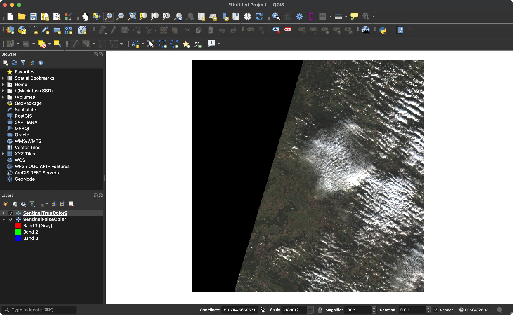

# Satellite Data Tools

## Setup

### Install conda

[Follow the official install guide.](https://docs.conda.io/projects/conda/en/latest/user-guide/install/index.html)

### Create conda env

```bash
conda env create --file envname.yml
```

### Environment variables

- Rename `.env.sample` to `.env`
- Add your password and username to the `.env` file

## Usage

## Specify search region

Create a `geojson` file with a bounding box that defines the search region.
[geojson.io](http://geojson.io/) is an easy way to create `geojson` files.


### Query and download data

#### CLI

List available sentinel 2 product data from Berlin with max 30 percent cloud coverage or less from one month until now.

```bash
sentinelsat -u <user> -p <password> --location Berlin --sentinel 2 --cloud 30 --start NOW-1MONTH
```

List available product data via `geojson`

```bash
sentinelsat -u <user> -p <password> -g <search_polygon.geojson>
```

List available sentinel 2 product data via `geojson` with less than 30 percent cloud coverage from now to 14 days ago

```bash
sentinelsat -u <user> -p <password> -g <search_polygon.geojson> --sentinel 2 --cloud 30 --start NOW-14DAYS --producttype S2MSI2A
```

Download available sentinel 2 product data via `geojson` from the last 24 hours (**NOTE**: that's a lot of gigabytes)

```bash
sentinelsat -u <user> -p <password> -g <search_polygon.geojson> --sentinel 2 -d --path ./downloads
```

Download specific data package via UUID

```bash
sentinelsat -u <user> -p <password> --uuid <uuid-of-data-package> -d --path ./downloads
```

#### Python API

- Execute the `query_data` with the desired configuration.
- Execute the `download_product` function with the specified product uuid.

### Process and display data

- In the `create_rgb_image` function pint the `imagePath` to the downloaded product.
- execute the `main.py` file with the uncommented `create_rgb_image` function to create an image in the `./processed` folder.
- Use `QGIS` to display the generated `.tiff` file.
  

#### Resources for RGB composition and more

https://github.com/arjun-majumdar/Satellite_Image_Analysis/blob/main/Sentinel-2_Satellite_Image_Analysis_with_Python.ipynb
https://gisgeography.com/top-6-free-lidar-data-sources/
